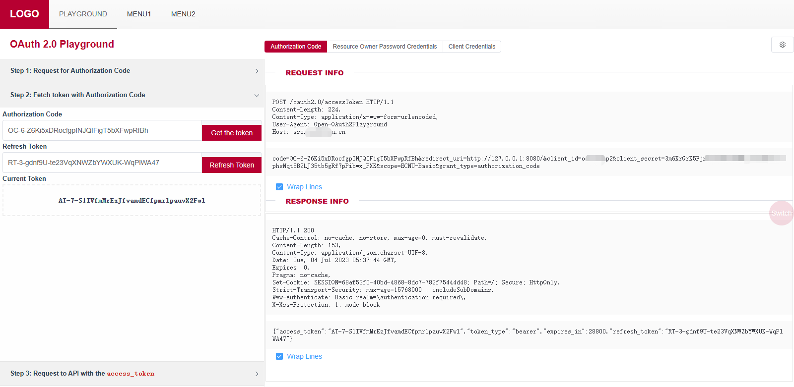

# Open-OAuth2Playground
Open-OAuth2Playground 是一个仿 Google [OAuth 2.0 Playground](https://developers.google.com/oauthplayground/)  的开源版 OAuth2.0 Playground

支持本地开箱即用，适合 OAuth2.0 的学习者测试学习 OAuth2.0 协议。

当运用于服务端部署时，也非常适合与 OAuth2 的接口文档配合同步发布，方便第三方调用者快速的开发调试。

[English](./README_en.md) | [中文](./README.md)



- [Open-OAuth2Playground](#open-oauth2playground)
	- [安装运行](#安装运行)
		- [二进制直接运行](#二进制直接运行)
			- [Linux](#linux)
			- [Windows](#windows)
		- [systemctl 托管](#systemctl-托管)
		- [编译打包](#编译打包)
			- [后端编译](#后端编译)
			- [前端编译](#前端编译)
			- [统一打包](#统一打包)
		- [docker运行](#docker运行)
		- [配置](#配置)
			- [后端配置](#后端配置)
				- [后端配置说明](#后端配置说明)
			- [前端配置](#前端配置)
				- [前端配置说明](#前端配置说明)
				- [前端部署](#前端部署)
				- [定制化前端菜单](#定制化前端菜单)
		- [API](#api)
		- [鸣谢](#鸣谢)


## 安装运行

### 二进制直接运行
#### Linux
在 [release](https://github.com/ECNU/Open-OAuth2Playground/releases) 中下载最新的 [release] 包，解压后直接运行即可。

```
mkdir Open-OAuth2Playground
cd Open-OAuth2Playground/
wget https://github.com/ECNU/Open-OAuth2Playground/releases/download/v0.2.0/Open-OAuth2Playground-linux-0.2.0.tar.gz
tar -zxvf Open-OAuth2Playground-linux-0.2.0.tar.gz
./control start
```
访问你服务器的 80 端口即可使用。

#### Windows
如果只需要在 Windows 上运行测试，可以直接下载 [release] 中的 `Open-OAuth2Playground-windows-0.2.0.zip`，解压后运行 `Open-OAuth2Playground.exe` 即可。

### systemctl 托管
假定部署在 `/opt/Open-OAuth2Playground` 目录下，如果部署在其他目录修改 `playground.service` 中的 `WorkingDirectory` 和 `ExecStart` 两个字段即可。
```
cp playground.service /etc/systemd/system/
systemctl daemon-reload
systemctl enable playground
systemctl start playground
```

### 编译打包
获取项目源码
```
git clone https://github.com/ECNU/Open-OAuth2Playground.git
```
#### 后端编译
```
cd Open-OAuth2Playground/
go mod tidy
go build
```
#### 前端编译
```
cd front-standalone/
pnpm install
pnpm build
```
#### 统一打包
```
cd ..
chmod +x control
./control pack
```

### docker运行

（内置用于测试的oauth2 server服务）

#### 1.给`cas_init_script.sh`文件添加执行权限

执行如下命令
```shell
chmod +x cas_init_script.sh
```

#### 2. 修改`docker-compose.yml`文件

##### 2.1 设置环境变量

修改`cas-demo`容器的`environment`字段

```yaml
environment:
	- CAS_SERVER_NAME=
	- SERVER_PORT=
```

如未设置，默认如下

```yaml
environment:
	- CAS_SERVER_NAME=http://localhost:8444
	- SERVER_PORT=8444
```

##### 2.2 修改端口映射

修改容器的`ports`字段

如第1步中`SERVER_PORT`非默认值8444，则需将`cas-demo`容器的端口修改为您设置的`SERVER_PORT`的值，注意容器和宿主机端口必须相同

```yml
# open-oauth2playground容器端口，可自行修改
ports:
	- "8080:80"
# cas-demo容器端口，两者需一致
ports:
	- "your_port:your_port"
```

#### 3. 修改`cfg.json`配置

##### 3.1 修改`endpoints`字段

将`cfg.json`文件中的`endpoints`字段中`cas server`的域名设置为第1步的`CAS_SERVER_NAME`，如第1步中未设置，则设置为`http://localhost:8444`

```json
"endpoints": {
    "authorization": "http://localhost:8444/cas/oauth2.0/authorize",
    "token": "http://localhost:8444/cas/oauth2.0/accessToken",
    "userinfo": "http://localhost:8444/cas/oauth2.0/profile"
  }
```
##### 3.2 修改`trust_domain`字段
若`CAS_SERVER_NAME`是`http://localhost:8444`，则在`cfg.json`文件中的`trust_domain`字段中添加`localhost:8444`,反之添加您设置的`CAS_SERVER_NAME`的值

```json
 "trust_domain": [
    "localhost:8444",
  ]
```

#### 4. 启动容器

在`docker-compose.yml`所在目录下执行如下命令

```shell
docker-compose up
```

在`cas-domo`容器日志中看到`ready`字样，即启动成功，访问`http://localhost:8080`即可。


#### 5. 注意

- **cas测试用户为**：
```txt
user:cas
password:123456
```
可编辑`cas_init_script.sh`脚本添加新用户或修改用户名、密码
```shell
INSERT INTO user (username, password, name) VALUES ('cas', '123456', '测试用户');
```

或启动后进入`cas-demo`容器/export/data/目录下，连接sqlite数据库cas.db后修改
```shell
# 进入cas-demo容器
docker exec -it container_id /bin/bash

cd /export/data
# 连接数据库
sqlite3 cas.db
```

- **cas的service**
  - authorization_code | client_credentials | device_flow模式：
    ```txt
    client_id:open-oauth2playground
    password:open-oauth2playground
    ```
    - pkce模式：
	```txt
	client_id:open-oauth2playground-pkce
	```
可在Open-OAuth2Playground/apereo-cas/etc/services目录下自行添加新的service


### 配置
#### 后端配置
参考 `cfg.json.example`, 创建 `cfg.jon` 配置文件，修改配置即可
```json
{
	"logger": {
		"dir": "logs/",
		"level": "DEBUG",
		"keepHours": 24
	},
	"endpoints": {
		"authorization": "http://cas.example.org/cas/oauth2.0/authorize",
		"token": "http://cas.example.org/cas/oauth2.0/accessToken",
		"userinfo": "http://cas.example.org/cas/oauth2.0/profile"
	},
	"iplimit": {
		"enable": false,
		"trust_ip": ["127.0.0.1","::1"]
	},
	"http": {
		"route_base":"/",
		"trust_proxy": ["127.0.0.1", "::1"],
		"cors": ["http://127.0.0.1:8080","http://localhost:8080"],
		"listen": "0.0.0.0:80"
	},
	"trust_domain": ["cas.example.org", "localhost"],
	"default_scope": "Basic",
	"timeout": 10
}
```
##### 后端配置说明
| 配置项 | 类型 | 说明 |
| --- | --- | --- |
| logger.dir | string | 日志文件夹 |
| logger.level | string | 日志等级 |
| logger.keepHours | int | 日志保留时间 |
| endpoints.authorization | string | OAuth2.0 授权地址 |
| endpoints.token | string | OAuth2.0 获取 token 地址 |
| endpoints.userinfo | string | OAuth2.0 获取用户信息地址 |
| iplimit.enable | bool | 是否开启 IP 限制 |
| iplimit.trust_ip | []string | 可信任的 IP 列表 |
| http.route_base | string | 路由前缀，注意要和前端匹配 |
| http.trust_proxy | []string | 可信任的代理 IP 列表 |
| http.cors | []string | 允许前端跨域的域名列表 |
| http.listen | string | 监听地址 |
| trust_domain | []string | 后端转发API调用时，信任的域名列表 |
| default_scope | string | 默认的 scope |
| timeout | int | 超时时间 |


#### 前端配置
修改 `.env.production`
```ini
# Router path
VUE_APP_ROUTER_BASE=/
# Api Config
VUE_APP_API_PROTO=http
VUE_APP_API_HOST=localhost
VUE_APP_API_PORT=
VUE_APP_API_VERSION=v1
```
##### 前端配置说明
| 配置项 | 类型| 说明 |
| --- | --- | --- |
| VUE_APP_ROUTER_BASE | string | 路由前缀，注意要和后端匹配 |
| VUE_APP_API_PROTO | string | 前端独立部署时需要，后端服务器的 proto |
| VUE_APP_API_HOST | string | 前端独立部署时需要，后端的域名 |
| VUE_APP_API_PORT | string | 前端独立部署时需要，后端的端口。如果是默认端口可忽略（例如https的443或者http的80） |
| VUE_APP_API_VERSION | string | API 版本，目前固定为 v1 |

##### 前端部署
项目的前端部分可以独立部署单独发布，也可以由后端来发布。

默认由后端发布，此时前端的 `VUE_APP_API_HOST`,`VUE_APP_API_PROTO`, `VUE_APP_API_PORT` 等配置项可以忽略。此时编译打包后的前端代码应该部署相对后端二进制文件的 front-standalone/dist 目录下。

如果前端独立部署，则需要在编译时，配置好 `VUE_APP_API_HOST`,`VUE_APP_API_PROTO`, `VUE_APP_API_PORT` 等配置项，并确保前端的域名在后端的跨域列表内。

##### 定制化前端菜单

项目的菜单部分，对应 `front-standalone/src/views/Layourt.vue` 文件，可以根据需要修改 `el-menu-item` 的内容，然后编译打包即可。

### API
todo


### 鸣谢
本项目受 Google 的 [OAuth 2.0 Playground](https://developers.google.com/oauthplayground/) 启发

感谢 Google 提供的优秀的工具。