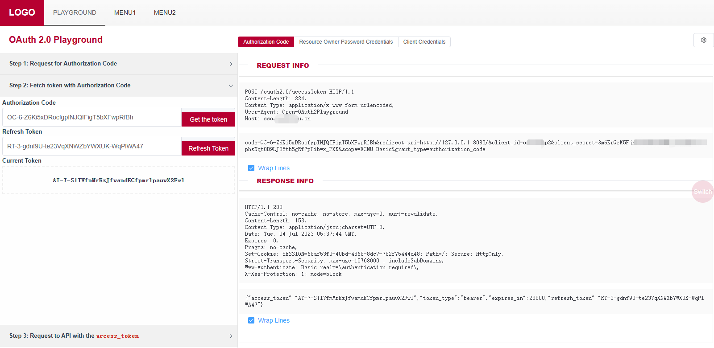

# Open-OAuth2Playground

[English](./README_en.md) | [中文](./README.md)

**[ 项目简介 ]**

Open-OAuth2Playground 是一个仿 Google [OAuth 2.0 Playground](https://developers.google.com/oauthplayground/)  的开源版 OAuth2.0 Playground 。

本项目支持本地开箱即用，适合 OAuth2.0 的学习者测试学习 OAuth2.0 协议。

当运用于服务端部署时，也非常适合与 OAuth2 的接口文档配合同步发布，方便第三方调用者快速的开发调试。

**注：** 本项目依赖于 [oauth-server-lite](https://github.com/shanghai-edu/oauth-server-lite/) 服务（或自行准备 / 配置用于鉴权的服务后端并修改 `cfg.json`），使用前需要先启动 oauth-server-lite 。如希望将本项目作为测试学习使用，建议使用 [方式四、docker 运行](#方式四docker-运行) 以快速拉起一套完整 Oauth2 鉴权、测试的前后端服务。



**[ 目录 ]**

- [Open-OAuth2Playground](#open-oauth2playground)
    - [安装运行](#安装运行)
        - [方式一、docker 一键部署运行](#方式一docker-一键部署运行)
        - [方式二、源码编译运行](#方式二源码编译运行)
            - [1. 获取项目源码](#1-获取项目源码)
            - [2. 修改配置文件](#2-修改配置文件)
            - [2. 修改配置文件](#2-修改配置文件)
            - [3. 前端编译](#3-前端编译)
            - [4. 后端编译](#4-后端编译)
            - [5. 运行](#5-运行)
            - [统一打包](#统一打包)
        - [方式三：二进制包-解压后直接运行](#方式三二进制包-解压后直接运行)
            - [Linux](#linux)
            - [Windows](#windows)
        - [方式四：二进制包-systemctl 托管运行](#方式四二进制包---systemctl-托管运行)
    - [配置](#配置)
        - [一、后端配置](#一后端配置)
            - [后端配置说明](#后端配置说明)
        - [二、前端配置](#二前端配置)
            - [前端配置说明](#前端配置说明)
        - [三、前端项目单独部署](#三前端项目单独部署)
            - [定制化前端菜单](#定制化前端菜单)
    - [使用](#使用)
    - [鸣谢](#鸣谢)

---

## 安装运行

本项目提供 docker 一键部署、手动源码编译运行、二进制文件一键运行和二进制文件托管运行 4 种方式。

docker 运行方式 #TODO

源码编译、二进制文件运行均依赖于 `Open-OAuth2Playground` 二进制文件和 `cfg` 配置文件。默认读取二进制文件平级目录的 `cfg.json` 文件作为配置文件，支持通过 `-c /path/to/cfg` 运行时传参的方式指定特定的 `cfg` 配置文件（systemctl 托管运行时需要自行修改 service 文件）。

### 方式一、docker 一键部署运行

（内置用于测试的 [oauth-server-lite](https://github.com/shanghai-edu/oauth-server-lite/) 服务）

项目提供 `docker-compose.yaml` 文件，可直接一键拉起。

```shell
docker-compose -p oauth-server-lite up -d
```

**注意事项**

- 此方式启动时，由于容器内无法直接通过 `localhost` 访问其它服务，因此需要通过访问 service name 的方式 ( `redis:6379` ) 连接 redis 。其它配置见文件。
- `cas.db` 默认写入用户信息：
    - `username: cas`，可通过配置 `${CAS_USERNAME}` 修改
    - `password: 123456`，可通过配置 `${CAS_PASSWORD}` 修改
- `sqlite.db` 默认写入 oauth client 信息：
    - `client_id: oauth`，可通过配置 `${OAUTH_CLIENT_ID}` 修改
    - `client_secret: 123456`，可通过配置 `${OAUTH_CLIENT_SECRET}` 修改
    - `domains: open-oauth2playground`，可通过配置 `${PLAYGROUND_HOST}` 修改
    - `grant_types: authorization_code,client_credentials,device_flow`，

[//]: # (todo:这部分要修改)
- **cas的service**
    - authorization_code | client_credentials | device_flow模式：
      ```txt
      client_id:open-oauth2playground
      password:open-oauth2playground
      ```
        - pkce模式：
      ```txt
      client_id:open-oauth2playground-pkce
      ```
可在Open-OAuth2Playground/apereo-cas/etc/services目录下自行添加新的service

### 方式二、源码编译运行

此方式面向开发者 / 高级用户等有二次开发 / 定制化需求的人员。

该方式需要首先完成配置文件 `cfg.json` 的修改，然后依次进行 [[3 前端编译]](#3-前端编译) 和 [[4 后端编译]](#4-后端编译)。

#### 前期准备：

- go >= 1.20.0
- pnpm (npm && node ^12.0.0 || >= 14.0.0)

#### 1. 获取项目源码

```shell
git clone https://github.com/ECNU/Open-OAuth2Playground.git
```

#### 2. 修改配置文件

参考 `cfg.json.example` 修改配置文件。

```shell
cd Open-OAuth2Playground
cp cfg.json.example cfg.json
# vim cfg.json  ## 修改配置文件
```

#### 3. 前端编译

```shell
cd front-standalone/
# 确保在 Open-OAuth2Playground/front-standalone 目录下
pnpm install
pnpm build
```

编译成功结果：

```shell
...

  Build at: 2024-10-31T03:41:50.137Z - Hash: fa1d180a37fe6b83 - Time: 32612ms

 DONE  Build complete. The dist directory is ready to be deployed.
 INFO  Check out deployment instructions at https://cli.vuejs.org/guide/deployment.html
 ```

此时 `front-standalone` 下会编译出 `dist` 目录。

#### 4. 后端编译

```shell
cd ..
# 确保在 Open-OAuth2Playground 根目录下
go mod tidy
go build
```

编译成功后，根目录下会编译出 `Open-OAuth2Playground` 二进制文件。

#### 5. 运行

```shell
./Open-OAuth2Playground 
```

输出：

```shell
[GIN-debug] [WARNING] Running in "debug" mode. Switch to "release" mode in production.
 - using env:   export GIN_MODE=release
 - using code:  gin.SetMode(gin.ReleaseMode)

[GIN-debug] GET    /css/*filepath            --> github.com/gin-gonic/gin.(*RouterGroup).createStaticHandler.func1 (4 handlers)
[GIN-debug] HEAD   /css/*filepath            --> github.com/gin-gonic/gin.(*RouterGroup).createStaticHandler.func1 (4 handlers)
[GIN-debug] GET    /js/*filepath             --> github.com/gin-gonic/gin.(*RouterGroup).createStaticHandler.func1 (4 handlers)
[GIN-debug] HEAD   /js/*filepath             --> github.com/gin-gonic/gin.(*RouterGroup).createStaticHandler.func1 (4 handlers)
[GIN-debug] GET    /                         --> github.com/ECNU/Open-OAuth2Playground/controller.Routes.(*RouterGroup).StaticFile.func1 (4 handlers)
[GIN-debug] HEAD   /                         --> github.com/ECNU/Open-OAuth2Playground/controller.Routes.(*RouterGroup).StaticFile.func1 (4 handlers)
[GIN-debug] GET    /favicon.ico              --> github.com/ECNU/Open-OAuth2Playground/controller.Routes.(*RouterGroup).StaticFile.func2 (4 handlers)
[GIN-debug] HEAD   /favicon.ico              --> github.com/ECNU/Open-OAuth2Playground/controller.Routes.(*RouterGroup).StaticFile.func2 (4 handlers)
[GIN-debug] GET    /v1/config                --> github.com/ECNU/Open-OAuth2Playground/controller.getConfig (4 handlers)
[GIN-debug] POST   /v1/oauth2/pkce           --> github.com/ECNU/Open-OAuth2Playground/controller.pkce (6 handlers)
[GIN-debug] POST   /v1/oauth2/user_code      --> github.com/ECNU/Open-OAuth2Playground/controller.getUserCode (6 handlers)
[GIN-debug] POST   /v1/oauth2/device_flow    --> github.com/ECNU/Open-OAuth2Playground/controller.deviceFlow (6 handlers)
[GIN-debug] POST   /v1/oauth2/client_credentials --> github.com/ECNU/Open-OAuth2Playground/controller.clientCredentials (6 handlers)
[GIN-debug] POST   /v1/oauth2/password       --> github.com/ECNU/Open-OAuth2Playground/controller.passwordMode (6 handlers)
[GIN-debug] POST   /v1/oauth2/authorization_code --> github.com/ECNU/Open-OAuth2Playground/controller.exchangeTokenByCode (6 handlers)
[GIN-debug] POST   /v1/oauth2/refresh_token  --> github.com/ECNU/Open-OAuth2Playground/controller.refreshToken (6 handlers)
[GIN-debug] POST   /v1/api                   --> github.com/ECNU/Open-OAuth2Playground/controller.api (6 handlers)
```

说明服务已经正常启动。访问 [http://127.0.0.1:80](http://127.0.0.1:80) （默认）或 `cfg.json` 配置的 `.http.listen` 即可访问 Open-OAuth2Playground 。

#### 统一打包

将编译后结果统一打包为 `Open-OAuth2Playground-${release}.tar.gz`：

```shell
cd ..
chmod +x control
./control pack
```

如需要增/改打包内容，请修改 control 文件。

### 方式三：二进制包-解压后直接运行

本项目提供已编译的项目压缩包，可直接下载解压运行。

#### Linux

在 [release](https://github.com/ECNU/Open-OAuth2Playground/releases) 中下载最新的 [release] 包，解压后直接运行即可。

```
mkdir Open-OAuth2Playground
cd Open-OAuth2Playground/
wget https://github.com/ECNU/Open-OAuth2Playground/releases/download/v0.2.0/Open-OAuth2Playground-linux-0.2.0.tar.gz
tar -zxvf Open-OAuth2Playground-linux-0.2.0.tar.gz
./control start
# ./control stop
```
访问你服务器的 80 端口即可使用（ 默认本地访问：[http://127.0.0.1:80](http://127.0.0.1:80) ）。

#### Windows

如果只需要在 Windows 上运行测试，可以直接下载 [release](https://github.com/ECNU/Open-OAuth2Playground/releases) 中的 `Open-OAuth2Playground-windows-0.2.0.zip`，解压后运行 `Open-OAuth2Playground.exe` 即可。

### 方式四：二进制包 - systemctl 托管运行

[[方式三、二进制包-解压后直接运行]](#方式三二进制包-解压后直接运行) 也可基于 systemctl 实现自动托管运行。

```
# 1. 在 /opt/Open-OAuth2Playground 下，下载解压 release 包
cd /opt
mkdir Open-OAuth2Playground
cd Open-OAuth2Playground/
wget https://github.com/ECNU/Open-OAuth2Playground/releases/download/v0.2.0/Open-OAuth2Playground-linux-0.2.0.tar.gz
tar -zxvf Open-OAuth2Playground-linux-0.2.0.tar.gz

# 2. 创建 service 文件
# 请根据具体需要调整文件内容

# 方式一：直接写入
sudo tee /etc/systemd/system/playground.service > /dev/null << 'EOF'
[Unit]
Description=playground
After=network-online.target
Wants=network-online.target

[Service]
# modify when deploy in prod env
User=root
Group=root

Type=simple
ExecStart=/opt/Open-OAuth2Playground/Open-OAuth2Playground
WorkingDirectory=/opt/Open-OAuth2Playground

Restart=always
RestartSec=1
StartLimitInterval=0

[Install]
WantedBy=multi-user.target
EOF

# 方式二：拷贝压缩包自带的 playground.service 到 system 目录
# cp playground.service /etc/systemd/system/playground.service

# 3. 启动 playground.service
systemctl daemon-reload
systemctl enable playground
systemctl start playground
```

此时文件树结构如下（`Open-OAuth2Playground` 二进制文件和 `cfg.json` 配置文件存在即可）。如果部署在其他目录，修改 `playground.service` 中的 `WorkingDirectory` 和 `ExecStart` 两个字段即可。

```shell
[root@iZm05jcnfytljnZ Open-OAuth2Playground]# tree /opt
/opt
└── Open-OAuth2Playground
    ├── cfg.json
    ├── control
    ├── front-standalone
    │   ├── dist
    │   │   ├── css
    │   │   │   ├── ...
    │   │   └── js
    │   │       └── ...
    │   └── ...
    ├── gitversion
    ├── logs
    │   ├── DEBUG.log
    │   ├── INFO.log
    │   └── *.log
    ├── Open-OAuth2Playground
    └── Open-OAuth2Playground-linux-0.2.0.tar.gz
```

## 配置

### 一、后端配置

参考 `cfg.json.example`, 创建 `cfg.jon` 配置文件，修改配置即可。

```json
{
  "logger": {
    "dir": "logs/",
    "level": "DEBUG",
    "keepHours": 24
  },
  "endpoints": {
    "authorization": "http://oauth.example.org/oauth2/device/authorize",
    "token": "http://oauth.example.org/oauth2/token",
    "userinfo": "http://oauth.example.org/oauth2/userinfo"
  },
  "iplimit": {
    "enable": false,
    "trust_ip": ["127.0.0.1","::1"]
  },
  "http": {
    "route_base":"/",
    "trust_proxy": ["127.0.0.1", "::1"],
    "cors": ["http://127.0.0.1:8080","http://localhost:8080"],
    "listen": "0.0.0.0:80"
  },
  "trust_domain": ["oauth.example.org", "localhost"],
  "default_scope": "Basic",
  "timeout": 10
}
```

#### 后端配置说明

| 配置项                     | 类型       | 说明                   |
|-------------------------|----------|----------------------|
| logger.dir              | string   | 日志文件夹                |
| logger.level            | string   | 日志等级                 |
| logger.keepHours        | int      | 日志保留时间               |
| endpoints.authorization | string   | OAuth2.0 授权地址        |
| endpoints.token         | string   | OAuth2.0 获取 token 地址 |
| endpoints.userinfo      | string   | OAuth2.0 获取用户信息地址    |
| iplimit.enable          | bool     | 是否开启 IP 限制           |
| iplimit.trust_ip        | []string | 可信任的 IP 列表           |
| http.route_base         | string   | 路由前缀，注意要和前端匹配        |
| http.trust_proxy        | []string | 可信任的代理 IP 列表         |
| http.cors               | []string | 允许前端跨域的域名列表          |
| http.listen             | string   | 监听地址                 |
| trust_domain            | []string | 后端转发API调用时，信任的域名列表   |
| default_scope           | string   | 默认的 scope            |
| timeout                 | int      | 超时时间                 |

### 二、前端配置

修改 `.env.production`：

```ini
# Router path
VUE_APP_ROUTER_BASE=/
# Api Config
VUE_APP_API_PROTO=http
VUE_APP_API_HOST=localhost
VUE_APP_API_PORT=
VUE_APP_API_VERSION=v1
```

#### 前端配置说明

| 配置项                 | 类型     | 说明                                               |
|---------------------|--------|--------------------------------------------------|
| VUE_APP_ROUTER_BASE | string | 路由前缀，注意要和后端匹配                                    |
| VUE_APP_API_PROTO   | string | 前端独立部署时需要，后端服务器的 proto                           |
| VUE_APP_API_HOST    | string | 前端独立部署时需要，后端的域名                                  |
| VUE_APP_API_PORT    | string | 前端独立部署时需要，后端的端口。如果是默认端口可忽略（例如https的443或者http的80） |
| VUE_APP_API_VERSION | string | API 版本，目前固定为 v1                                  |

### 三、前端项目单独部署

项目的前端部分可以独立部署单独发布，也可以由后端来发布。

默认由后端发布，此时前端的 `VUE_APP_API_HOST`,`VUE_APP_API_PROTO`, `VUE_APP_API_PORT` 等配置项可以忽略。此时编译打包后的前端代码应该部署相对后端二进制文件的 front-standalone/dist 目录下。

如果前端独立部署，则需要在编译时，配置好 `VUE_APP_API_HOST`,`VUE_APP_API_PROTO`, `VUE_APP_API_PORT` 等配置项，并确保前端的域名在后端的跨域列表内。

#### 定制化前端菜单

项目的菜单部分，对应 `front-standalone/src/views/Layourt.vue` 文件，可以根据需要修改 `el-menu-item` 的内容，然后编译打包即可。

## 使用

### 一、Authorization Code 模式

### 二、Resource Owner Password Credentials 模式

### 三、Client Credentials 模式

### 四、Device Flow 模式

### 五、PKCE 模式

## 鸣谢

本项目受 Google 的 [OAuth 2.0 Playground](https://developers.google.com/oauthplayground/) 启发

感谢 Google 提供的优秀的工具。