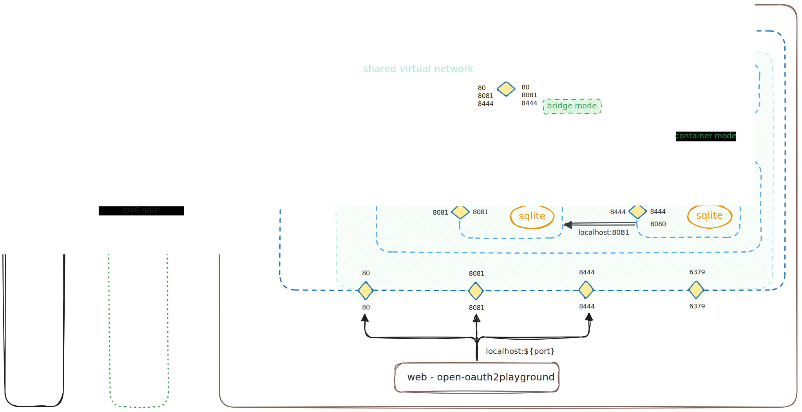
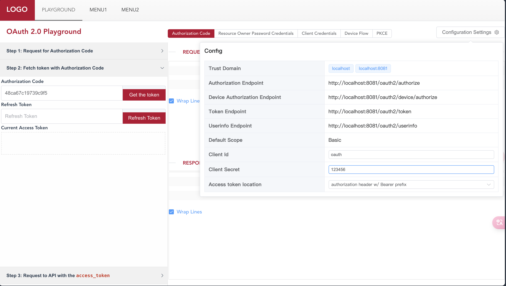
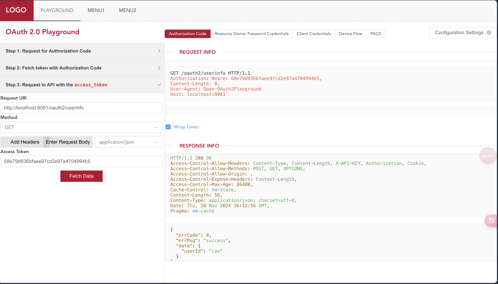
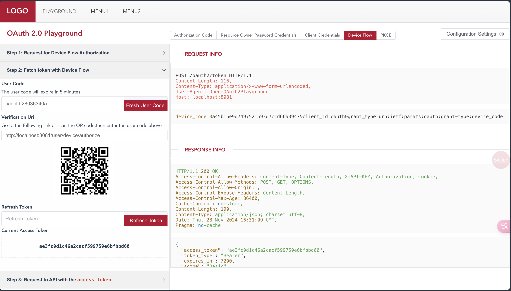
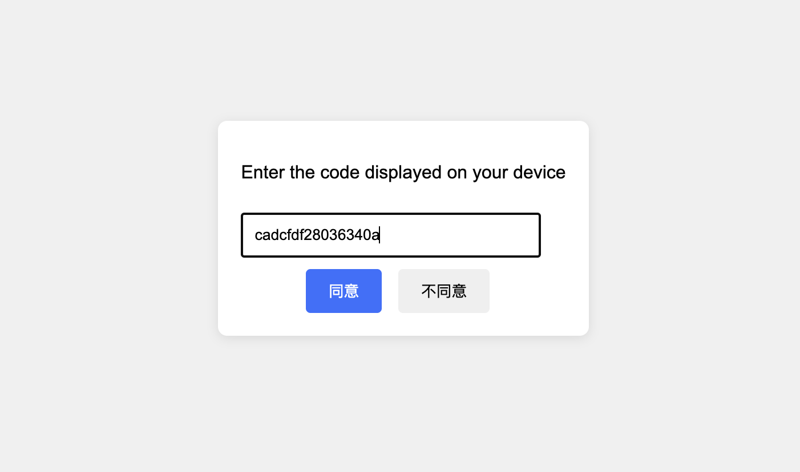
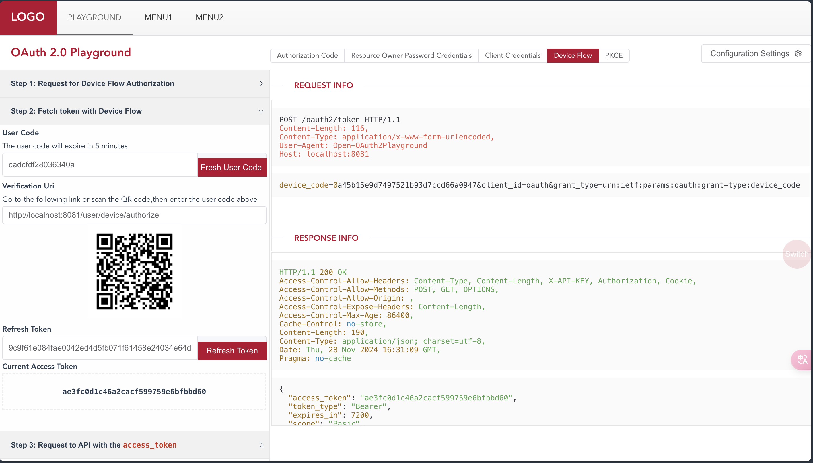
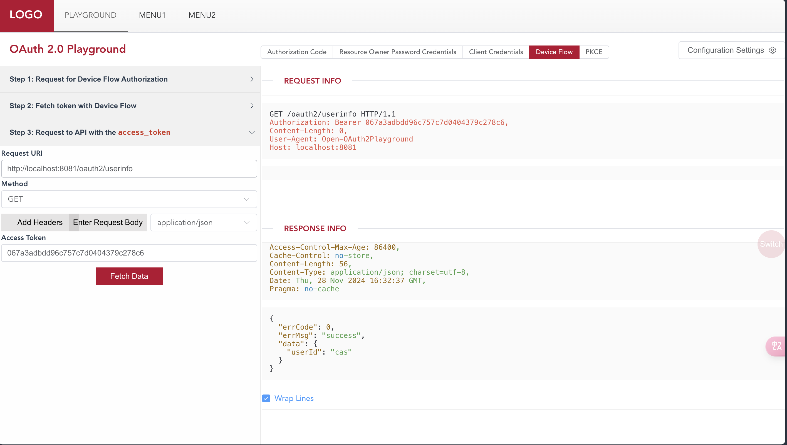
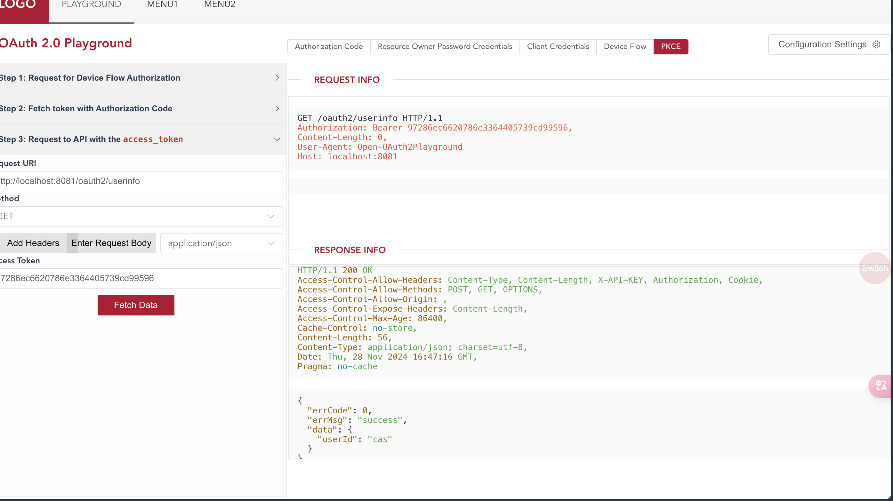

# Open-OAuth2Playground

[English](./README_en.md) | [中文](./README.md)

**[Project Introduction]**

Open-OAuth2Playground is an open-source version of OAuth2.0 Playground, modeled after Google's [OAuth 2.0 Playground](https://developers.google.com/oauthplayground/).

This project supports out-of-the-box local use, making it suitable for learners to test and learn the OAuth2.0 protocol.

When deployed on the server side, it is also ideal for synchronizing with OAuth2 interface documentation, facilitating rapid development and debugging for third-party callers.

**Note:** This project relies on the [oauth-server-lite](https://github.com/shanghai-edu/oauth-server-lite/) service (or prepare your own / configure the authorization service backend and modify `cfg.json`), and you need to start oauth-server-lite before use. If you wish to use this project for testing and learning, it is recommended to use [Method Four: Docker Operation](#Method-Four-Docker-Operation) to quickly set up a complete set of front-end and back-end services for OAuth2 authorization and testing.


**[Table of Contents]**

- [Open-OAuth2Playground](#open-oauth2playground)
	- [Installation and Operation](#installation-and-operation)
		- [Method One: Docker One-click Deployment and Operation](#Method-One-Docker-One-click-Deployment-and-Operation)
		- [Method Two: Source Code Compilation and Operation](#Method-Two-Source-Code-Compilation-and-Operation)
			- [1. Obtain the Project Source Code](#1-Obtain-the-Project-Source-Code)
			- [2. Modify the Configuration File](#2-Modify-the-Configuration-File)
			- [3. Front-end Compilation](#3-Front-end-Compilation)
			- [4. Back-end Compilation](#4-Back-end-Compilation)
			- [5. Operation](#5-Operation)
			- [Unified Packaging](#Unified-Packaging)
		- [Method Three: Binary Package - Unzip and Run Directly](#Method-Three-Binary-Package---Unzip-and-Run-Directly)
			- [Linux](#Linux)
			- [Windows](#Windows)
		- [Method Four: Binary Package - Systemctl Hosted Operation](#Method-Four-Binary-Package---Systemctl-Hosted-Operation)
	- [Configuration](#configuration)
		- [I. Backend Configuration](#I-Backend-Configuration)
			- [Backend Configuration Description](#Backend-Configuration-Description)
		- [II. Frontend Configuration](#II-Frontend-Configuration)
			- [Frontend Configuration Description](#Frontend-Configuration-Description)
		- [III. Frontend Project Independent Deployment](#III-Frontend-Project-Independent-Deployment)
			- [Customized Frontend Menu](#Customized-Frontend-Menu)
	- [Usage](#usage)
	- [Acknowledgements](#acknowledgements)

---

## Installation and Operation

This project provides four methods: Docker one-click deployment, manual source code compilation and operation, binary file one-click operation, and binary file hosted operation with systemctl.

Docker operation method #TODO

Both source code compilation and binary file operation depend on the `Open-OAuth2Playground` binary file and `cfg` configuration file. The default reads the `cfg.json` file in the same directory as the binary file as the configuration file, and supports specifying a specific `cfg` configuration file at runtime through the `-c /path/to/cfg` parameter (you need to modify the service file yourself when running with systemctl).

### Method One: Docker One-click Deployment and Operation

(Built-in [oauth-server-lite](https://github.com/shanghai-edu/oauth-server-lite/) service for testing)

The project provides a `docker-compose.yaml` file, which can be started with one click. `docker-compose.yaml` provides a container-based startup solution. This solution allows for a shared `redis` and `oauth-server-lite` container network, for testing purposes only.



```shell
docker-compose -p oauth-server-lite up -d
```

**Notes**

- When starting in this way, since containers cannot directly access other services via `localhost`, you need to connect to redis via the service name (e.g., `redis:6379`). See the file for other configurations.
- `cas.db` writes default user information:
	- `username`: `cas`, can be modified via `${CAS_USERNAME}`
	- `password`: `123456`, can be modified via `${CAS_PASSWORD}`
- `sqlite.db` writes default oauth client information:
	- `client_id`: `oauth`, can be modified via `${OAUTH_CLIENT_ID}`
	- `client_secret`: `123456`, can be modified via `${OAUTH_CLIENT_SECRET}`
	- `domains`: `open-oauth2playground`, can be modified via `${PLAYGROUND_HOST}`
	- `grant_types`: `password`,`authorization_code`,`urn:ietf:params:oauth:grant-type:device_code`,`client_credentials`

- You can add new services in the `Open-OAuth2Playground/apereo-cas/etc/services` directory as needed.

### Method Two: Source Code Compilation and Operation

This method is aimed at developers / advanced users who have secondary development / customization needs.

This method requires you to first complete the modification of the configuration file `cfg.json`, and then proceed with [3 Front-end Compilation](#3-Front-end-Compilation) and [4 Back-end Compilation](#4-Back-end-Compilation) in sequence.

#### Prerequisites:

- go >= 1.20.0
- pnpm (npm && node ^12.0.0 || >= 14.0.0)

#### 1. Obtain the Project Source Code

```shell
git clone https://github.com/ECNU/Open-OAuth2Playground.git
```

#### 2. Modify the Configuration File

Refer to `cfg.json.example` to modify the configuration file.

```shell
cd Open-OAuth2Playground
cp cfg.json.example cfg.json
# vim cfg.json  ## Modify the configuration file
```

#### 3. Front-end Compilation

```shell
cd front-standalone/
# Ensure you are in the Open-OAuth2Playground/front-standalone directory
pnpm install
pnpm build
```

Compilation success result:

```shell
...

  Build at: 2024-10-31T03:41:50.137Z - Hash: fa1d180a37fe6b83 - Time: 32612ms

 DONE  Build complete. The dist directory is ready to be deployed.
 INFO  Check out deployment instructions at https://cli.vuejs.org/guide/deployment.html
 ```

At this point, a `dist` directory will be compiled under `front-standalone`.

#### 4. Back-end Compilation

```shell
cd ..
# Ensure you are in the Open-OAuth2Playground root directory
go mod tidy
go build
```

After successful compilation, the `Open-OAuth2Playground` binary file will be compiled in the root directory.

#### 5. Operation

```shell
./Open-OAuth2Playground 
```

Output:

```shell
[GIN-debug] [WARNING] Running in "debug" mode. Switch to "release" mode in production.
 - using env:   export GIN_MODE=release
 - using code:  gin.SetMode(gin.ReleaseMode)

[GIN-debug] GET    /css/*filepath            --> github.com/gin-gonic/gin.(*RouterGroup).createStaticHandler.func1 (4 handlers)
[GIN-debug] HEAD   /css/*filepath            --> github.com/gin-gonic/gin.(*RouterGroup).createStaticHandler.func1 (4 handlers)
[GIN-debug] GET    /js/*filepath             --> github.com/gin-gonic/gin.(*RouterGroup).createStaticHandler.func1 (4 handlers)
[GIN-debug] HEAD   /js/*filepath             --> github.com/gin-gonic/gin.(*RouterGroup).createStaticHandler.func1 (4 handlers)
[GIN-debug] GET    /                         --> github.com/ECNU/Open-OAuth2Playground/controller.Routes.(*RouterGroup).StaticFile.func1 (4 handlers)
[GIN-debug] HEAD   /                         --> github.com/ECNU/Open-OAuth2Playground/controller.Routes.(*RouterGroup).StaticFile.func1 (4 handlers)
[GIN-debug] GET    /favicon.ico              --> github.com/ECNU/Open-OAuth2Playground/controller.Routes.(*RouterGroup).StaticFile.func2 (4 handlers)
[GIN-debug] HEAD   /favicon.ico              --> github.com/ECNU/Open-OAuth2Playground/controller.Routes.(*RouterGroup).StaticFile.func2 (4 handlers)
[GIN-debug] GET    /v1/config                --> github.com/ECNU/Open-OAuth2Playground/controller.getConfig (4 handlers)
[GIN-debug] POST   /v1/oauth2/pkce           --> github.com/ECNU/Open-OAuth2
Playground/controller.pkce (6 handlers)
[GIN-debug] POST   /v1/oauth2/user_code      --> github.com/ECNU/Open-OAuth2Playground/controller.getUserCode (6 handlers)
[GIN-debug] POST   /v1/oauth2/device_flow    --> github.com/ECNU/Open-OAuth2Playground/controller.deviceFlow (6 handlers)
[GIN-debug] POST   /v1/oauth2/client_credentials --> github.com/ECNU/Open-OAuth2Playground/controller.clientCredentials (6 handlers)
[GIN-debug] POST   /v1/oauth2/password       --> github.com/ECNU/Open-OAuth2Playground/controller.passwordMode (6 handlers)
[GIN-debug] POST   /v1/oauth2/authorization_code --> github.com/ECNU/Open-OAuth2Playground/controller.exchangeTokenByCode (6 handlers)
[GIN-debug] POST   /v1/oauth2/refresh_token  --> github.com/ECNU/Open-OAuth2Playground/controller.refreshToken (6 handlers)
[GIN-debug] POST   /v1/api                   --> github.com/ECNU/Open-OAuth2Playground/controller.api (6 handlers)
```

The service has started normally. Visit [http://127.0.0.1:80](http://127.0.0.1:80) (default) or the `.http.listen` configured in `cfg.json` to access Open-OAuth2Playground.

#### Unified Packaging

Package the compiled results into `Open-OAuth2Playground-${release}.tar.gz`:

```shell
cd ..
chmod +x control
./control pack
```

If you need to add/modify the packaging content, please modify the control file.

### Method Three: Binary Package - Unzip and Run Directly

This project provides a pre-compiled project compressed package, which can be directly downloaded and unzipped for operation.

#### Linux

Download the latest [release] package from [release](https://github.com/ECNU/Open-OAuth2Playground/releases), unzip it, and run it directly.

```
mkdir Open-OAuth2Playground
cd Open-OAuth2Playground/
wget https://github.com/ECNU/Open-OAuth2Playground/releases/download/v0.2.0/Open-OAuth2Playground-linux-0.2.0.tar.gz
tar -zxvf Open-OAuth2Playground-linux-0.2.0.tar.gz
./control start
# ./control stop
```
Access your server's port 80 to use it (default local access: [http://127.0.0.1:80](http://127.0.0.1:80)).

#### Windows

If you only need to run tests on Windows, you can directly download the `Open-OAuth2Playground-windows-0.2.0.zip` from [release](https://github.com/ECNU/Open-OAuth2Playground/releases), unzip it, and run `Open-OAuth2Playground.exe`.

### Method Four: Binary Package - Systemctl Hosted Operation

[Method Three: Binary Package - Unzip and Run Directly](#Method-Three-Binary-Package---Unzip-and-Run-Directly) can also be automatically hosted and operated with systemctl.

```
# 1. Download and unzip the release package in /opt/Open-OAuth2Playground
cd /opt
mkdir Open-OAuth2Playground
cd Open-OAuth2Playground/
wget https://github.com/ECNU/Open-OAuth2Playground/releases/download/v0.2.0/Open-OAuth2Playground-linux-0.2.0.tar.gz
tar -zxvf Open-OAuth2Playground-linux-0.2.0.tar.gz

# 2. Create a service file
# Please adjust the file content according to your specific needs

# Method One: Directly write in
sudo tee /etc/systemd/system/playground.service > /dev/null << 'EOF'
[Unit]
Description=playground
After=network-online.target
Wants=network-online.target

[Service]
# modify when deploy in prod env
User=root
Group=root

Type=simple
ExecStart=/opt/Open-OAuth2Playground/Open-OAuth2Playground
WorkingDirectory=/opt/Open-OAuth2Playground

Restart=always
RestartSec=1
StartLimitInterval=0

[Install]
WantedBy=multi-user.target
EOF

# Method Two: Copy the playground.service from the compressed package to the system directory
# cp playground.service /etc/systemd/system/playground.service

# 3. Start playground.service
systemctl daemon-reload
systemctl enable playground
systemctl start playground
```

At this point, the file tree structure is as follows (the `Open-OAuth2Playground` binary file and `cfg.json` configuration file must exist). If deployed in other directories, modify the `WorkingDirectory` and `ExecStart` fields in `playground.service`.

```shell
[root@iZm05jcnfytljnZ Open-OAuth2Playground]# tree /opt
/opt
└── Open-OAuth2Playground
    ├── cfg.json
    ├── control
    ├── front-standalone
    │   ├── dist
    │   │   ├── css
    │   │   │   ├── ...
    │   │   └── js
    │   │       └── ...
    │   └── ...
    ├── gitversion
    ├── logs
    │   ├── DEBUG.log
    │   ├── INFO.log
    │   └── *.log
    ├── Open-OAuth2Playground
    └── Open-OAuth2Playground-linux-0.2.0.tar.gz
```

## Configuration

### I. Backend Configuration

Refer to `cfg.json.example`, create a `cfg.jon` configuration file, and modify the configuration.

```json
{
  "logger": {
    "dir": "logs/",
    "level": "DEBUG",
    "keepHours": 24
  },
  "endpoints": {
    "authorization": "http://oauth.example.org/oauth2/device/authorize",
    "token": "http://oauth.example.org/oauth2/token",
    "userinfo": "http://oauth.example.org/oauth2/userinfo"
  },
  "iplimit": {
    "enable": false,
    "trust_ip": ["127.0.0.1","::1"]
  },
  "http": {
    "route_base":"/",
    "trust_proxy": ["127.0.0.1", "::1"],
    "cors": ["http://127.0.0.1:8080","http://localhost:8080"],
    "listen": "0.0.0.0:80"
  },
  "trust_domain": ["oauth.example.org", "localhost"],
  "default_scope": "Basic",
  "timeout": 10
}
```

#### Backend Configuration Description

| Configuration Item      | Type     | Description                                                 |
|-------------------------|----------|-------------------------------------------------------------|
| logger.dir              | string   | Log folder                                                  |
| logger.level            | string   | Log level                                                   |
| logger.keepHours        | int      | Log retention time                                          |
| endpoints.authorization | string   | OAuth2.0 authorization address                              |
| endpoints.token         | string   | OAuth2.0 token acquisition address                          |
| endpoints.userinfo      | string   | OAuth2.0 user information acquisition address               |
| iplimit.enable          | bool     | Whether to enable IP restriction                            |
| iplimit.trust_ip        | []string | List of trusted IPs                                         |
| http.route_base         | string   | Route prefix, note to match with the front end              |
| http.trust_proxy        | []string | List of trusted proxy IPs                                   |
| http.cors               | []string | List of domains allowed for front-end cross-domain          |
| http.listen             | string   | Listening address                                           |
| trust_domain            | []string | List of trusted domains when the backend forwards API calls |
| default_scope           | string   | Default scope                                               |
| timeout                 | int      | Timeout time                                                |

### II. Frontend Configuration

Modify `.env.production`:

```ini
# Router path
VUE_APP_ROUTER_BASE=/
# Api Config
VUE_APP_API_PROTO=http
VUE_APP_API_HOST=localhost
VUE_APP_API_PORT=
VUE_APP_API_VERSION=v1
```

#### Frontend Configuration Description

| Configuration Item  | Type   | Description                                                                                                                                                    |
|---------------------|--------|----------------------------------------------------------------------------------------------------------------------------------------------------------------|
| VUE_APP_ROUTER_BASE | string | Route prefix, note to match with the backend                                                                                                                   |
| VUE_APP_API_PROTO   | string | Needed when the front end is deployed independently, the proto of the backend server                                                                           |
| VUE_APP_API_HOST    | string | Needed when the front end is deployed independently, the domain name of the backend                                                                            |
| VUE_APP_API_PORT    | string | Needed when the front end is deployed independently, the port of the backend. If it's the default port, it can be ignored (e.g., 443 for https or 80 for http) |
| VUE_APP_API_VERSION | string | API version, currently fixed at v1                                                                                                                             |

### III. Frontend Project Independent Deployment

The front-end part of the project can be deployed and published independently, or it can be published by the backend.

By default, it is published by the backend, at which time the front-end configurations such as `VUE_APP_API_HOST`,`VUE_APP_API_PROTO`, `VUE
_APP_API_PORT` can be ignored. At this time, the compiled and packaged front-end code should be deployed under the front-standalone/dist directory relative to the backend binary file.

If the front end is deployed independently, it is necessary to configure `VUE_APP_API_HOST`,`VUE_APP_API_PROTO`, `VUE_APP_API_PORT` and other configuration items during compilation, and ensure that the domain name of the front end is within the backend's cross-domain list.

#### Customized Frontend Menu

The menu part of the project corresponds to the `front-standalone/src/views/Layourt.vue` file, and you can modify the content of `el-menu-item` as needed, and then compile and package.

## Usage

**[Reference 1]** [RFC6749](https://www.rfc-editor.org/rfc/rfc6749.html)

First, you need to enter the `Open-OAuth2Playground` front-end home page, and complete the information configuration in the top right corner `Configuration Settings`:



### I. Authorization Code Mode

Authorization Code Mode is also known as the authorization code flow. The steps are as follows:

1. Visit the APP service, i.e., click the GO icon, at this time the client will direct the user to the authentication server (Authorization Server), i.e., `apereo-cas` server;
2. The user (after logging in) chooses whether to authorize;
3. After authorization, the authentication server directs the user to the redirect URI, and returns the authorization code, i.e., the `Authorization Code` in Step 2;
4. With this authorization code, the user can obtain an access token (Token) and a refresh access token. Then you can carry the access token to access the resource server, i.e., Step 3.



### II. Resource Owner Password Credentials Mode

Resource Owner Password Credentials Mode is also known as the password flow. The steps are as follows:

1. Visit the APP service, and provide the username and password to the client, then click Get Token;
2. Obtain the access token, and you can access the resource server.


### III. Client Credentials Mode

Client Credentials Mode is also known as the client flow. The steps are as follows:

1. The client directly authenticates to the authentication server and requests an access token (without user information);
2. The authentication server provides the client with an access token, which is used to access the resource server.


In client flow, the authentication behavior is initiated by the client. Since there is no binding of user information, it can be seen that although the request is successful, the user cannot obtain content related to personal information.

### IV. Device Flow Mode

Device Flow Mode is also known as the device flow. The steps are as follows:

1. Visit the APP service, i.e., click the GO icon, the client will provide a user verification code (User Code). At this time, the client will send the verification code to the authentication server and listen to the status of the authentication server;
   
2. The user can scan the code or enter the authentication page through the authentication link (which can be a different device) and complete the authentication by entering the verification code within the valid time;
   
3. After successful authentication, return to the client, at this time the client successfully listens to the user completing the authentication and obtaining the access token;
   
   
4. The user can access the resource server with this access token.
   

### V. PKCE Mode

PKCE (Proof Key for Code Exchange) mode is a more secure authorization code flow. The steps are as follows:

1. The client generates a random `code verifier` (click Refresh), and obtains the `code challenge` through `code challenge method` (e.g., SHA256);
2. The user also authorizes through the authentication server (click GO, and complete the authentication at the authentication server, redirected back to the client by the authentication server), obtaining the authorization code;
3. Different from the authorization code flow, the PKCE authorization code flow requires the `code verifier` to be carried for authentication when obtaining the access token, to prevent interception attacks on the authorization code;
4. After obtaining the access token, you can access the resource server.



## Acknowledgements

This project is inspired by Google's [OAuth 2.0 Playground](https://developers.google.com/oauthplayground/).

Thank you to Google for providing such an excellent tool.
